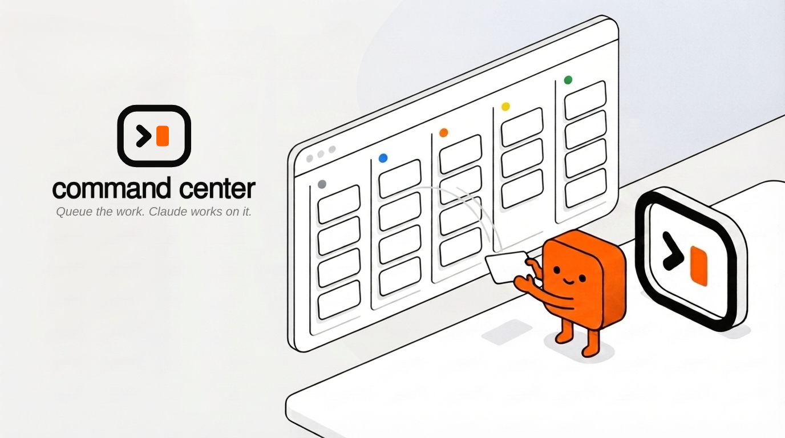

<p align="center">
  
</p>

<p align="center">
  <strong>Queue the work. Claude works on it.</strong><br />
  A local task board that keeps your kanban queue and your Claude Code session in lockstep —
  running entirely on your machine, with no accounts, no cloud, and no background daemon.
</p>

---

## Install

Requires [Bun](https://bun.sh) 1.3 or newer (`curl -fsSL https://bun.sh/install | bash`).

In Claude Code:

```
/plugin marketplace add yeahitsmejayyy/command-center
/plugin install command-center@command-center
```

There is no compile step and nothing is downloaded at runtime. Before you install it, [SECURITY.md](SECURITY.md) says exactly what it runs, reads, and writes — worth two minutes for anything that hooks your sessions.

## The loop

Start a session in a project. command-center offers to set it up; run `/command-center:enable` and the board opens in your browser.

From there:

1. **Add tasks** on the board — a title, instructions for Claude, and any files worth attaching. Drag them into **Queue** when they're ready.
2. **Run `/command-center:start`.** Claude takes the next queued task and works it. The board follows along.
3. **Review.** Finished work lands in **In Review**. Approve it, or send it back for another pass.

The board and the session stay in step in both directions: what Claude does shows up on the board, and what you drag on the board is what Claude picks up next.

## Commands

| In Claude | |
|---|---|
| `/command-center:enable` | Use command-center in this project |
| `/command-center:skip` | Leave this project alone |
| `/command-center:start` | Start the next queued task |

| In a terminal | |
|---|---|
| `cmc list` | Show the board (`--json` for scripting) |
| `cmc add "…"` | Add a task (`--body`, `--plan`, `--queued`) |
| `cmc advance` / `finish` / `approve` / `revise` | Work the queue by hand |
| `cmc doctor` | Diagnose problems, with the fix for each |
| `cmc cleanup` | Stop an unused board server |

## When something looks wrong

**Run `cmc doctor` first.** Every failure it knows about has a name and a command that fixes it.

| Symptom | Cause | Fix |
|---|---|---|
| No board when a session starts | Project not enabled | `/command-center:enable` |
| "command-center needs Bun" | Bun missing, or not on the hook's `PATH` | `curl -fsSL https://bun.sh/install \| bash`, then restart the session |
| Board says "Server not responding" | The server stopped; the port is gone | Reload — a new session starts a fresh one. Or `cmc cleanup` |
| Board is stale or empty | State file unreadable | `cmc doctor` prints the path and the command to move it aside |
| Nothing happens on `/command-center:start` | Nothing queued, or a task is already running | The command says which |

Logs are per project: `cmc doctor` prints the path.

## What it is not

No database — JSON files under a lock. No daemon — servers live and die with your sessions. Loopback only. One task in progress at a time, on purpose.

## Deeper

- [SECURITY.md](SECURITY.md) — what it touches, and how to audit it
- [docs/architecture.md](docs/architecture.md) — the state machine, layer boundaries, on-disk layout
- [docs/decisions/](docs/decisions/) — why the significant calls were made
- [docs/build-log/](docs/build-log/) — how it was built, including what broke
- [CHANGELOG.md](CHANGELOG.md) — including migration from v1

Licensed under [MIT](LICENSE).
